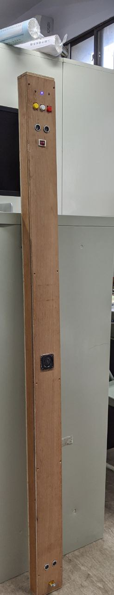
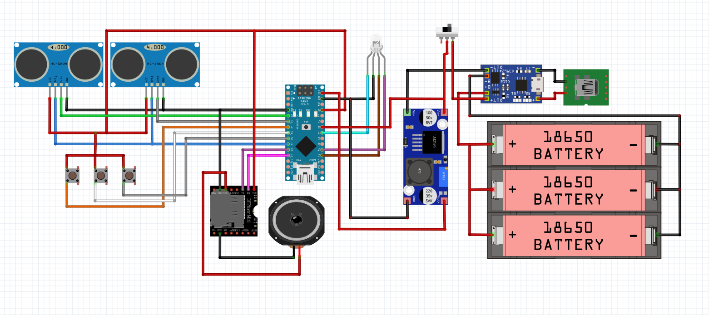

# App project





by [fritzing](https://fritzing.org/)
## Board
Arouino nano

## Use Modules:
HC-SR04 x2

DFPlayer MINI

LM2596

TP4056

## Code

```cpp
#include <AltSoftSerial.h>
#include "DFRobotDFPlayerMini.h"        // 採用DFRobotDFPlayerMini程式庫

DFRobotDFPlayerMini myDFPlayer;
AltSoftSerial altSerial;
//RX, TX(8, 9)

#define tINT 2            // Total number of interrupts
#define triggerPin 7      // Pin number for the common trigger
#define pingDelay 20      // How many milliseconds between each measurement ; keep > 5ms
#define debugDelay 200    // How many milliseconds between each Serial.print ; keep > 200ms
#define soundSpeed 343.0  // Speed of sound in m/s

volatile unsigned long travelTime[tINT];  // Place to store traveltime of the pusle
volatile unsigned long startTime[tINT];   // Place to store ping times (interrupt)
float distance[tINT];                     // Calculated distances in cm
unsigned long lastPollMillis;
unsigned long lastDebugMillis;

unsigned long lastbuttondetect;
#define buttondelay 50
#define BUTTON_PIN_1 4// 
#define BUTTON_PIN_2 6//volume_value+
#define BUTTON_PIN_3 5//volume_value-

#define LED_1 A0 //教室
#define LED_2 A1 //樓梯口
#define LED_3 A4 //低電量
#define Power_detect A5//電壓檢測
#define Low_Voltage_Set 3.0

unsigned long lastpowerdetect;
#define powerdetectdelay 1000

int volume_value = 25;

#define location_num 2
String location[location_num] = {"Doorway", "Staircase"};
int location_code[location_num] = {70, 145};
int location_flag = 0;
//教室門口 110
//樓梯口 145

#define sensorDelay 500
unsigned long fristDetect;

bool situation_flag = false; //感應器1先讀到在讀2


bool mp3_flag = false;
unsigned long mp3begin;
bool mp3_playing_flag = false;
int inloop = 0, invariant = 0, cnt = 0;


/****************************************************************
      SETUP
****************************************************************/
void setup()
{

  Serial.begin(115200);
  altSerial.begin(9600);


  while (!Serial) {
    ; // Wait for Serial
  }
  if (!myDFPlayer.begin(altSerial))                 // 如果DFPlayer Mini回應不正確.
  { //Use softwareSerial to communicate with mp3.   // 印出下面3行字串
    Serial.println(F("Unable to begin:"));                      // 然後程式卡死.
    Serial.println(F("1.Please recheck the connection!"));
    Serial.println(F("2.Please insert the SD card!"));
    while (true);
  }

  //Serial.println("--- Serial monitor started ---");
  pinMode(triggerPin, OUTPUT);   // Set common triggerpin as output

  pinMode(2, INPUT);    // Set interrupt pin 2 (INT0) as INPUT (sensor 1) 下
  pinMode(3, INPUT);    // Set interrupt pin 3 (INT1) as INPUT (sensor 2) 上
  attachInterrupt(0, call_INT0, CHANGE );   // ISR for INT0
  attachInterrupt(1, call_INT1, CHANGE );   // ISR for INT1

  pinMode(BUTTON_PIN_1, INPUT);
  pinMode(BUTTON_PIN_2, INPUT);
  pinMode(BUTTON_PIN_3, INPUT);

  pinMode(LED_1, OUTPUT);
  pinMode(LED_2, OUTPUT);
  pinMode(LED_3, OUTPUT);
  pinMode(Power_detect, INPUT);

  myDFPlayer.volume(volume_value);

  lastPollMillis = millis();
  lastDebugMillis = millis();
  lastbuttondetect = millis();
  lastpowerdetect = millis();
  //myDFPlayer.play();
}
/****************************************************************
      LOOP
****************************************************************/
void loop()
{
  // Poll every x ms
  if (millis() - lastPollMillis >= pingDelay)
  {

    doMeasurement();
        for (int i = 0; i < tINT; i++) {
      //Serial.print(distance[i]);
      //Serial.print(",");
    }
    //sensor 1 is distance[1] 下
    //sensor 2 is distance[0] 上
    if (distance[1] < location_code[location_flag] && situation_flag != true) {
      situation_flag = true;
      fristDetect = millis();
    }

    if (millis() - fristDetect <= sensorDelay ) {
      if (situation_flag == true && distance[0] > location_code[location_flag]) {
        // Serial.println("true");
        mp3_flag = true;
        cnt++;
      } else {
        mp3_flag = false;
        cnt = 0;
        //Serial.println("false");
      }
      situation_flag = false;
      
    }
    Serial.print(cnt);
    Serial.println();
    lastPollMillis = millis();
  }
  // Print every y ms (comment out in production)
  if (millis() - lastDebugMillis >= debugDelay)
  {

    lastDebugMillis = millis();
  }
  if (mp3_flag == true && mp3_playing_flag != true && cnt > 50) {
    myDFPlayer.play();
    mp3begin = millis();
    cnt = 0;
    mp3_flag = false;
    mp3_playing_flag = true;
  }
  if (millis() - mp3begin >= 3000) {
    myDFPlayer.stop();
    mp3_playing_flag = false;
  }
  if (millis() - lastpowerdetect >= powerdetectdelay) {
    int sensorValue = analogRead(Power_detect); //read the A0 pin value
    float voltage = sensorValue * (5.00 / 1023.00); //convert the value to a true voltage.
    if (voltage < Low_Voltage_Set) {
      digitalWrite(LED_3, HIGH);
    } else {
      digitalWrite(LED_3, LOW);
    }
    lastpowerdetect = millis();
  }
  if (millis() - lastbuttondetect >= buttondelay) {
    if (digitalRead(BUTTON_PIN_1) == HIGH) {
      if (location_flag == location_num - 1) {
        location_flag = 0;
      } else {
        location_flag++;
      }
      delay(300);
    }
    if (digitalRead(BUTTON_PIN_2) == HIGH) {
      if (volume_value == 30) {
        volume_value = 30;
      }
      else {
        volume_value++;
      }
      myDFPlayer.volume(volume_value);
    }
    if (digitalRead(BUTTON_PIN_3) == HIGH) {
      if (volume_value == 0) {
        volume_value = 0;
      } else {
        volume_value--;
      }
      myDFPlayer.volume(volume_value);
    }

    if (location_flag == 0) {
      digitalWrite(LED_1, HIGH);
      digitalWrite(LED_2, LOW);
    }
    if (location_flag == 1) {
      digitalWrite(LED_1, LOW);
      digitalWrite(LED_2, HIGH);
    }
    lastbuttondetect = millis();
  }

}
/****************************************************************
      Retrieve measurement and set next trigger
****************************************************************/
void doMeasurement()
{
  // First read will be 0 (no distance  calculated yet)
  // Read the previous result (pause interrupts while doing so)
  noInterrupts();   // cli()6++++++++++++++++++++++++++++++++++++++++++++++++++++++++++++++++++++++++++++++++++++++++
  for (int i = 0; i < tINT; i++)
  {
    distance[i] = travelTime[i] / 2.0 * (float)soundSpeed / 10000.0;   // in cm
  }
  interrupts();   // sei();
  // Initiate next trigger
  // digitalWrite(triggerPin, LOW);  // rest of loop already takes > 2µs
  // delayMicroseconds(2);
  digitalWrite(triggerPin, HIGH);    // HIGH pulse for at least 10µs
  delayMicroseconds(10);
  digitalWrite(triggerPin, LOW);     // Set LOW again
}
/****************************************************************
      INTERRUPT handling
****************************************************************/
// INTerrupt 0 (pin 2 on Uno)
void call_INT0()
{
  byte pinRead;
  // pinRead = digitalRead(2);      // Slower ; Read pin 2
  pinRead = PIND >> 2 & B00000001;  // Faster ; Read pin 2/PD2
  interruptHandler(pinRead, 0);
}
// INTerrupt 1 (pin 3 on Uno)
void call_INT1()
{
  byte pinRead;
  // pinRead = digitalRead(3);      // Slower ; Read pin 3
  pinRead = PIND >> 3 & B00000001;  // Faster ; Read pin 3/PD3
  interruptHandler(pinRead, 1);
}
// Common function for interrupts
void interruptHandler(bool pinState, int nIRQ)
{
  unsigned long currentTime = micros();  // Get current time (in µs)
  if (pinState)
  {
    // If pin state has changed to HIGH -> remember start time (in µs)
    startTime[nIRQ] = currentTime;
  }
  else
  {
    // If pin state has changed to LOW -> calculate time passed (in µs)
    travelTime[nIRQ] = currentTime - startTime[nIRQ];
  }
}

```